# 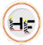 La comanda

Aplicación para dispositivos móviles desarollada en ionic3 que permitirá la gestión y el servicio de un restaurante ficticio. A través de esta aplicacion, distintas personas podrán registrarse e iniciar sesión y en base a su tipo de usuario, tendrán acceso a ciertas funcionalidades o no.

## Integrantes

* Lareu, Fernando ([1caruxx](https://github.com/1caruxx)) - alfa
* Vega, Facundo ([facundoVega](https://github.com/facundoVega)) - beta
* Quinteros, Axel ([Jigen21](https://github.com/Jigen21)) - gamma  
* Equipo: Hardcod3ros_furiosos

## Responsabilidades

⬆️ Lareu, Fernando 
Branch del proyecto: [lareu_alfa](https://github.com/1caruxx/TP_PPS_2018_Comanda/tree/lareu_alfa)

**Objetivos a desarollar:**

* [x] A- Alta dueño / supervisor.
* [x] B- Alta de empleados.
* [x] H- QR de propina.
* [x] K- Encuesta de supervisor.
* [x] N- Hacer reservas agendadas.
* [x] Q- Hacer reservas agendadas.
* [x] V- Juego para un postre gratis.

---

* [x] Vista y funcionalidad de la página de inicio de sesión.
* [x] Vista y funcionalidad de la página principal.
* [x] Vista y funcionalidad de la página de la cuenta.
* [x] Vista y funcionalidad de la página del perfil del usuario.
* [x] Vista y funcionalidad de la página de sala de juegos.
* [x] Responsable de la fusión de las ramas de codigo de los integrantes del grupo.

**Fecha de inicio:** 17/11/2018 
**Fecha de fin:** 24/11/2018

---

⬆️ Vega, Facundo 
Branch del proyecto: [vega_beta](https://github.com/1caruxx/TP_PPS_2018_Comanda/tree/vega_beta)

**Objetivos a desarollar:**

* [x] C- Alta de platos y bebidas.
* [x] D- Alta de cliente.
* [x] F- QR de ingreso al local.
* [x] I- Encuesta de cliente.
* [x] L- Pedir platos y bebidas.
* [x] P- Pedido de platos y bebidas.
* [x] T- Juego 10% de descuento.

**Fecha de inicio:** 17/11/18 
**Fecha de fin:** 24/11/18

---

⬆️ Quinteros, Axel 
Branch del proyecto: [quinteros_gamma](https://github.com/1caruxx/TP_PPS_2018_Comanda/tree/quinteros_gamma)

**Objetivos a desarollar:**

* [x] E- Alta de mesa.
* [x] G- QR de la mesa.
* [x] J- Encuesta de empleado.
* [x] M- Tomar pedido.
* [x] O- Pedir mesa.
* [x] S- Mapa de ruta hasta el domicilio de entrega.
* [x] V- Juego para un postre gratis.

---

* [x] Ícono y Splash de la aplicación.
* [x] Sonido de la aplicación.
* [x] Vista de mapa de ruta hasta el domicilio de la entrega.

**Fecha de inicio:** 17/11/2018 
**Fecha de fin:** 24/11/2018

## Profesores

* [Maximiliano Neiner](https://github.com/maxineiner)
* [Octavio villegas](https://github.com/octaviovillegas)

## QR De Bienvenida o ingreso al local

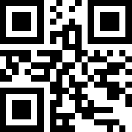

## QRS Mesas

* QR Mesa 1

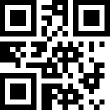

* QR Mesa 2

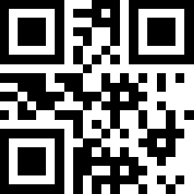

* QR Mesa 3

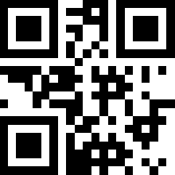

* QR Mesa 4

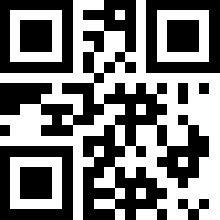

* QR Mesa 5

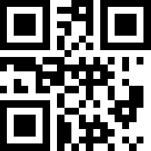

* QR Mesa 6

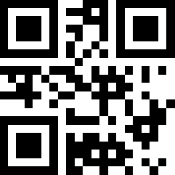

* QR Mesa 7

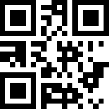

* QR Mesa 8

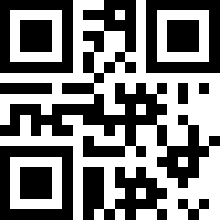

* QR Mesa 9

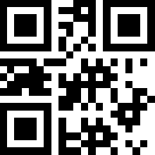

* QR Mesa 10

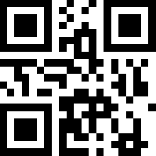

## QRS Productos

* QR Agua

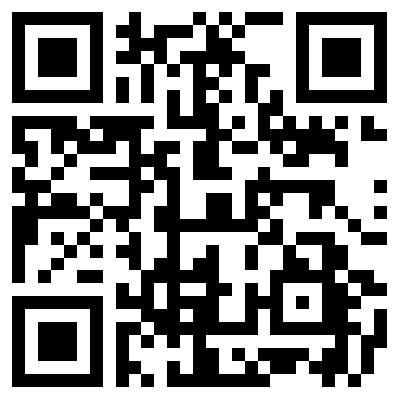

* QR Cerveza

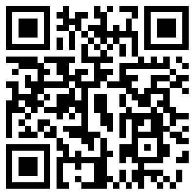

* QR Coca Cola

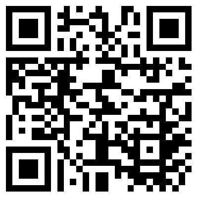

* QR Jugo de naranja

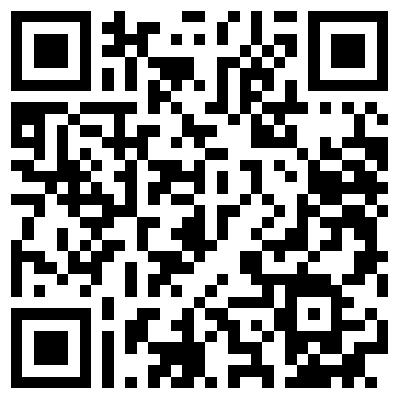